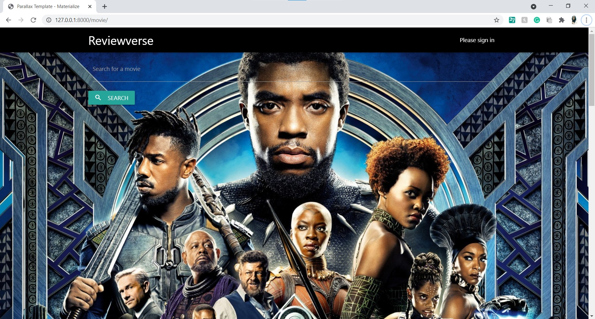
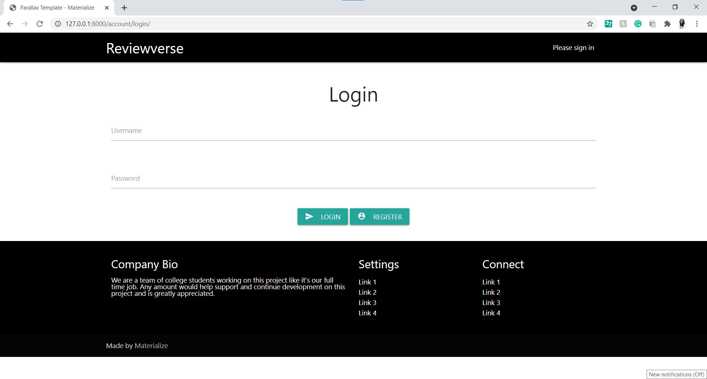
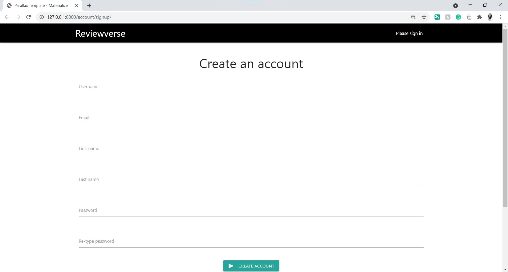
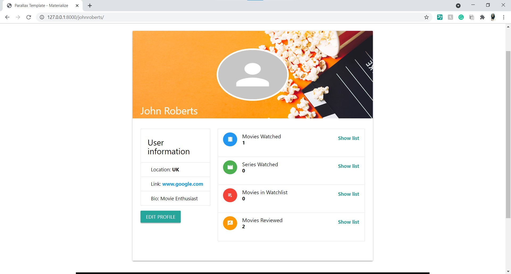
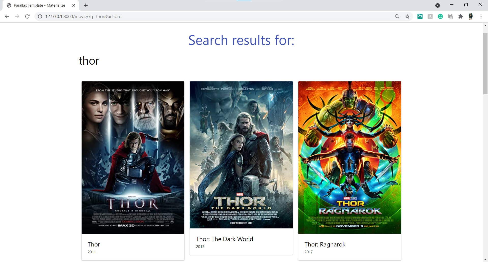
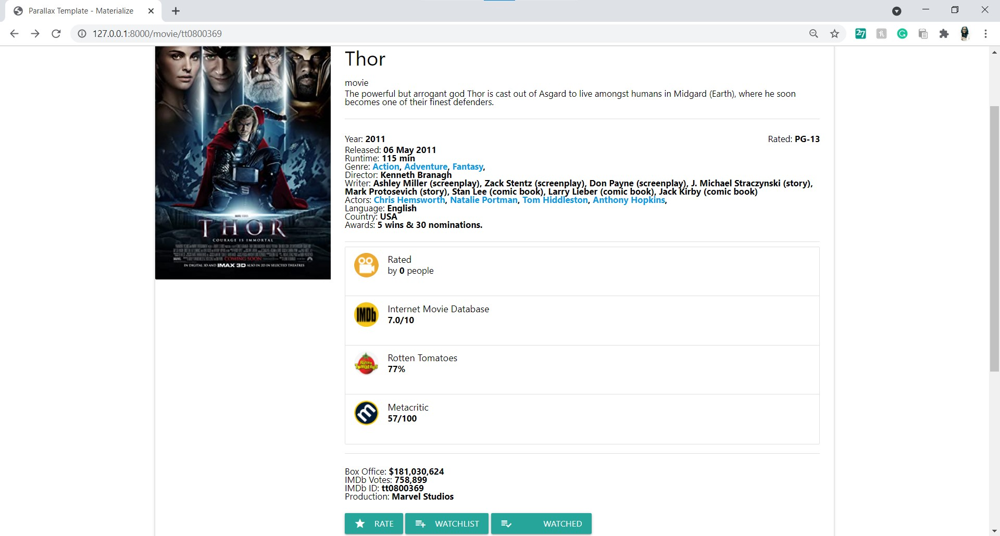
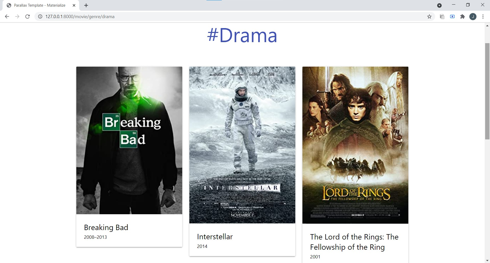
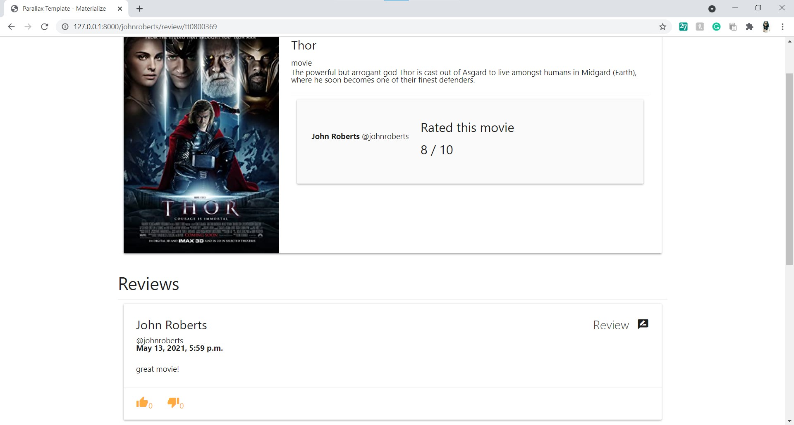

# Reviewverse
An interactive Movie Review Website where you can search, rate and review movies from all over the Internet.

This project was undertaken for the course 18CSC206J.

## API Used
[OMDb API: ](https://www.omdbapi.com/)
This API has been used to obtain all movie information including all content and images.

## Demo
- Home

- Login

- Register

- User Profile

- Search

- Movie Details

- Genre

- Rate and Review

- Watchlist

## Built With
* [Materialize](https://materializecss.com/) - A modern responsive front-end framework based on Material Design
* [Django](https://www.djangoproject.com/) - Web framework
